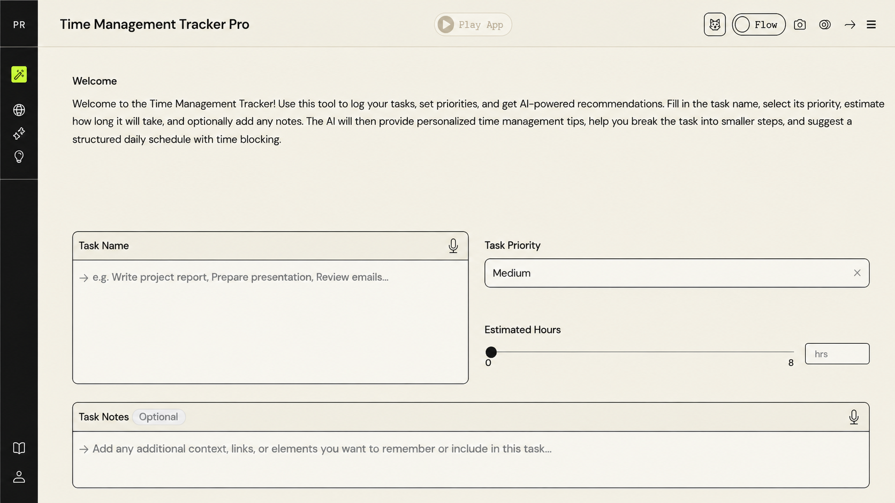
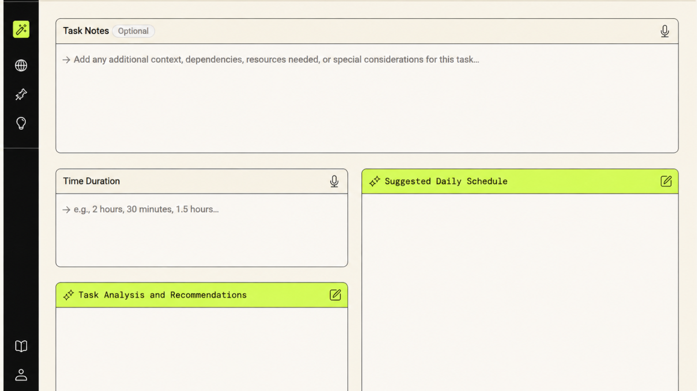
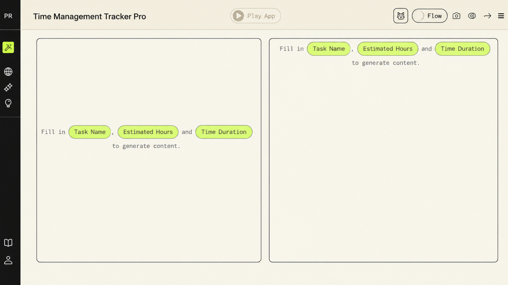

# Time Management Tracker Pro

An AI-powered task management tool that helps users log tasks, set priorities, and receive personalized time-management recommendations using time-blocking principles.

🔗 **Live app:** https://partyrock.aws/u/miranagorom/6cYZ5YdI4/Time-Management-Tracker-Pro

## Screenshots

**Welcome & task input**

**Task inputs**

**AI-generated analysis & schedule**

## Overview

Time Management Tracker Pro takes a user's raw task list and turns it into a structured, prioritized daily schedule. Instead of leaving prioritization and scheduling entirely to the user, the AI reasons over the task list to recommend what to do when applying time-blocking principles to reduce decision fatigue and improve daily execution.

## How it works

The app is built as a set of interconnected input and AI-generated widgets:

**Inputs**
- **Task Name** — free-text entry of the task
- **Task Priority** — Low / Medium / High
- **Estimated Hours** — slider input (0–8 hrs)
- **Time Duration** — free-text (e.g. "2 hours, 30 minutes")
- **Task Notes** *(optional)* — context, dependencies, resources needed, or special considerations

**AI-generated outputs**
- **Task Analysis and Recommendations** — the AI reasons over the task name, priority, estimated hours, and any notes to produce personalized time-management tips and break the task into smaller, actionable steps
- **Suggested Daily Schedule** — the AI synthesizes all inputs into a structured daily schedule using time-blocking principles

The flow is intentionally structured, not a single free-form prompt: raw task input flows into two dependent AI widgets that each reason over the same shared context to produce complementary outputs (analysis + schedule) a small-scale example of composing multiple AI reasoning steps around a shared input state.

## Why I built this

This project was an exercise in applying AI reasoning to a genuinely useful, everyday problem: most people don't struggle with knowing *what* they need to do, they struggle with *sequencing and prioritizing* it. I wanted to test how well an AI system could take unstructured task input and turn it into something immediately actionable, a core pattern in agentic product design.

## Tech

Built on **AWS PartyRock**, powered by foundation models via **Amazon Bedrock**.

## Roadmap

- [ ] Add recurring task support
- [ ] Integrate with calendar tools for real schedule sync
- [ ] Add adaptive re-prioritization when tasks are missed or delayed

---
